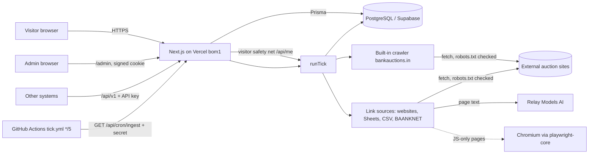
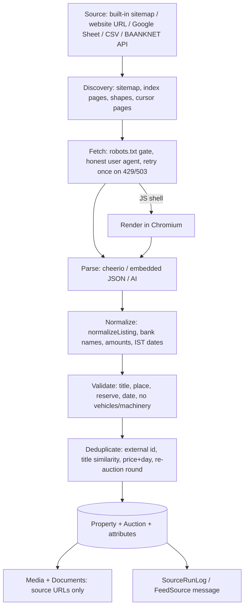
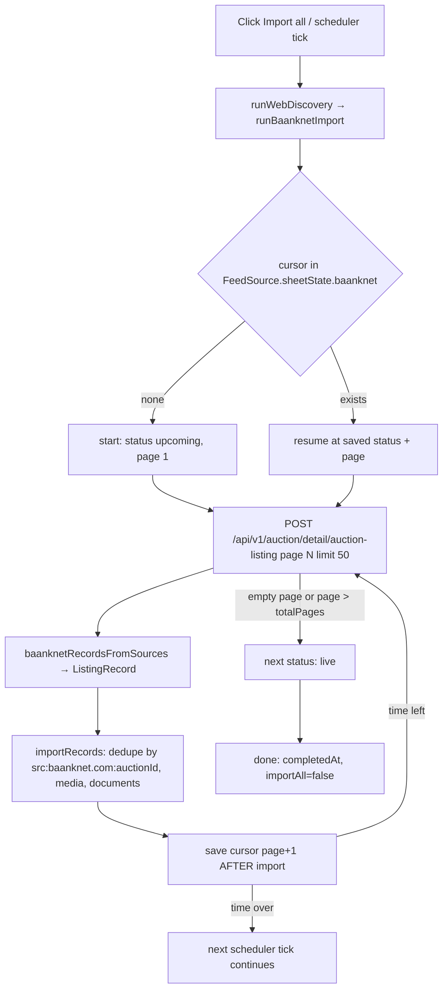
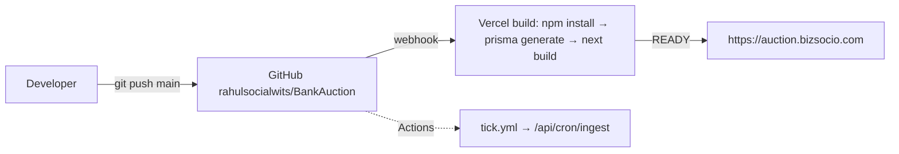
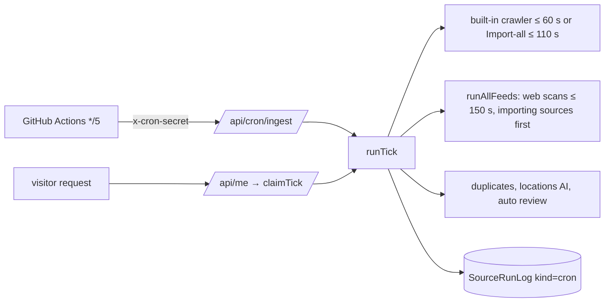

# Architecture

## 1. Overall architecture

* One Next.js application serves the public site, the admin, the JSON API and the scheduler endpoint. There is **no separate worker**:
  all crawling runs inside serverless function invocations (limit 300 s, `maxDuration = 300`) and must be resumable (cursors in the DB).
* The database is the only shared state. Browsers never talk to it.

## 2. Request types and where they are handled

| Type | Where | Notes |
|---|---|---|
| Public pages | `src/app/(site)/**` | server components, ISR via `export const revalidate` (120 s for lists, 300 s for static pages) |
| Admin pages | `src/app/admin/(shell)/**` | gated by `src/proxy.ts` (cookie `admin_session`); server actions in `actions.ts` files do the writes |
| JSON API | `src/app/api/**` | see [API.md](API.md) |
| Scheduler | `src/app/api/cron/ingest/route.ts`, `src/app/api/me/route.ts` | see [SCHEDULER.md](SCHEDULER.md) |

## 3. Import pipeline

Full detail: [DATA-IMPORT.md](DATA-IMPORT.md).

## 4. BAANKNET flow

Details: [BAANKNET.md](BAANKNET.md).

## 5. Deployment

## 6. Scheduler

## 7. Folder and file guide (important files)

### `src/app/api/`
`cron/ingest/route.ts` (scheduler endpoint, GET, secret) · `me/route.ts` (current user + safety-net tick) · `v1/*` (public API) ·
`img/[key]`, `media/[id]` (serve uploaded site images / media-library images from the DB) · `places`, `localities` (search suggestions) ·
`media-list` (master admin only).

### `src/data-sources/`
| File | Purpose | Key exports |
|---|---|---|
| `registry.ts` | static list of known sources + access notes used by the built-in adapter and politeFetch | `getSourceDefinition` |
| `bankauctions/adapter.ts` | built-in crawler of bankauctions.in (sitemap `/wp-sitemap-auctions-1.xml`) | `runBankAuctionsIngestion`, `ensureSourceRow`, `builtInImportAll`, `setBuiltInImportAll` |
| `bankauctions/extract.ts`, `normalize.ts` | table extraction and normalization for that site | `extractBankAuctionsListing`, `normalizeBankAuctionsRecord` |
| `feeds/run.ts` | link-source runner | `runFeedSource`, `runWebDiscovery`, `runFeedFull`, `runAllFeeds`, `validateFeedUrl`, `isAiFeed`, `rejectionNote` |
| `feeds/baanknetImport.ts` | BAANKNET resumable importer | `runBaanknetImport`, `baanknetStateOf`, `isBaanknetUrl` |
| `feeds/webScan.ts` | list-page AI scan, robots check, `UA` | `scanWebPage`, `robotsCheck`, `htmlToText`, `DEFAULT_EXTRACTION_PROMPT` |
| `feeds/siteScan.ts` | whole-site discovery of listing pages and reading new ones | `discoverListingUrls`, `scanSiteForNew`, `webStateOf`, `withWebState` |
| `feeds/deepScan.ts` | read one listing in depth (page + PDFs + AI), fetch layer with render fallback | `realDeps`, `makeDeepener`, `DEEP_PROMPT`, `noticeLinks`, `extractBaanknetEmbeddedAuctions`, `baanknetRecordsFromSources` |
| `feeds/render.ts`, `renderedParser.ts` | JS-shell detection, browser rendering wrapper, code parser of rendered detail pages | `isJsShell`, `RenderingFetcher`, `parseRenderedProperty`, `toListingRecord` |
| `feeds/robotsGate.ts` | robots.txt read once per site, Crawl-delay | `RobotsGate` |
| `feeds/blockedHosts.ts` | the do-not-fetch list | `BLOCKED_HOSTS`, `checkSourceUrl`, `denylistMatch` |
| `feeds/sheets.ts` | Google Sheet tab discovery + CSV export | `listSheetTabs`, `fetchTabCsv`, `sheetIdFromUrl` |

### `src/lib/`
| Folder / file | Purpose |
|---|---|
| `import/csvImport.ts` | **the importer**: `importRecords`, `importCsvText`, `parseCsv`, `ListingRecord`, `enrichExisting`, re-auction rounds, media/doc attach |
| `import/normalize.ts` | `normalizeListing`, `canonicalBankKey/Name` (one bank = one row) |
| `import/tabular.ts`, `richRaw.ts` | Google Sheet / CSV layouts (known layouts + AI column mapping), "Raw Source Records" parser |
| `pipeline/tick.ts` | `runTick`, `claimTick` |
| `pipeline/aiSchedule.ts` | slot markers and per-source AI lock (`acquireAiLock`) |
| `pipeline/duplicates.ts`, `geo.ts`, `review.ts`, `thinFix.ts`, `runLog.ts`, `locations.ts` | duplicate hiding, AI location check, auto review, thin-listing fix, run log |
| `ai/relayModelsClient.ts`, `aiConfig.ts`, `rules.ts` | AI client, settings, rules |
| `auth/*` | admin/user sessions (HMAC cookies), scrypt passwords, `requireMaster` |
| `fetch/httpStatus.ts`, `robotsRules.ts`, `politeFetch.ts` | status classification + one retry, robots matching, polite fetch for the built-in crawler |
| `queries/*` | read queries used by pages (lists, places, cities, home config) |
| `scrapDemo/*` | "AI Python Scrap — DEMO" engine (in-memory) and the shared `BrowserRenderer` |
| `payments/settings.ts` | Razorpay settings (no checkout) |
| `pages/*` | editable public pages (About, policies, FAQ) |
| `admin/propertyFilter.ts` | admin Properties filters + bulk-hide helpers |

### `src/app/admin/(shell)/`
`engine` (Data Engine: sources, Run/Import all, history, duplicates), `properties` (list, edit, new, import), `sources`/`feeds` (legacy source pages),
`ai`, `api`, `home`, `pages`, `media`, `leads`, `users`, `payments`, `admins`, `settings`, `blog`, `localities`, `scrap-demo`.

## 8. What happens if a file is changed (high-risk ones)
* `src/lib/import/csvImport.ts` — every importer calls it; a bug here affects all sources and can create duplicates.
* `src/lib/pipeline/tick.ts` / `feeds/run.ts` — scheduler behaviour and time budgets; the whole tick must end inside 300 s.
* `next.config.ts` — removing the Chromium file-tracing entries makes the render fallback fail in production ("no Chromium executable").
* `src/proxy.ts` / `lib/auth/*` — admin protection.
* `prisma/schema.prisma` — there are no migration files: a schema change needs `npx prisma db push` against the right database.

## 9. Frontend
Public site (`src/app/(site)`), all server components with ISR (`revalidate` 120 s for lists/property pages, 300 s for static pages) unless noted.
| Page | File | What it does |
|---|---|---|
| Home | `(site)/page.tsx` | hero search (`HeroSearch`), counts, newest/upcoming property carousels, "Explore by city", banks, blog; content editable in Admin → Home Page (`HomeConfig`) |
| Listing / search | `(site)/properties/page.tsx` | server-side filtered list, 48 per page (`listPublishedProperties(filters, take, skip)`), `PropertyFilterForm`, `PropertyCard`; searches with `q` are `noindex` |
| Property detail | `(site)/property/[slug]/page.tsx` | auction summary (rows only when the value exists — never "Not Available"), borrower blurred behind "Unlock" when present, "Previous auctions" table for re-auctions, overview, property details (attributes), legal schedule, documents (list of links to the notice files), similar listings, enquiry form (`PropertyEnquiry` → `Lead`) |
| Auctions by status | `(site)/auctions`, `auctions/[status]` | lists by auction status |
| Bank / city / type | `bank/[slug]`, `banks`, `city/[slug]`, `cities`, `property-type/[slug]`, `property-types` | directory pages (`BankDirectory`, `CityDirectory`) |
| Content | `about`, `faq`, `how-it-works`, `pricing`, `contact`, policies, `blog` | editable pages (`SitePage`, `BlogPost`) |
| Accounts | `login`, `register`, `saved-properties`, `my-alerts` | visitor accounts (`user_session`) |
Shared components in `src/components`: `Header`, `Footer`, `MobileNav`, `SearchBar`, `HeroSearch`, `PropertyCard` (shows reserve price / auction date only when present), `PropertyCarousel`, `ResponsiveImage`, `AuctionCountdownTable`, `JsonLd` (structured data), `RichText`, `FaqView`, `AboutView`, `PolicyView`. Props, loading/empty/error states of each component: NOT VERIFIED beyond this file level. Responsive layout uses Tailwind breakpoints (mobile menu `MobileNav`). Property photos: the property **detail** page renders only the placeholder image (`PLACEHOLDER_IMAGE_URL`) — attached `Media` URLs are stored but not shown there; the **cards** use the first media URL (`PropertyCard` `imageUrl`, loaded by `listPublishedProperties`) with the placeholder as fallback.

## 10. Search and filtering (`src/lib/queries/listProperties.ts`)
`publishedWhere(filters)` is shared by the website lists, the counts and the public API. Filters: `category`, `bankId`, `addressText`, `keyword` (case-insensitive `contains` on title, description, addressText), `state`, `city`, `locality` (AI-verified `geoState/geoCity/geoLocality` first; properties the AI has not checked yet (`geoCheckedAt = null`) fall back to a text match), `statusGroup` (`active` = UPCOMING/LIVE/AUCTION_TODAY; `completed` = everything else; `all`), `priceMin/priceMax` (on `auctions.some.reservePrice`). Always `status = PUBLISHED`; sorted `createdAt desc`; paging by `take/skip` (48 per page on the site, 1–50 in the API). Indexes that help: `properties(category,status)`, `properties(geoCity)`, `auctions(status,auctionStart)`, `auctions(bankId)`; text search uses `ILIKE '%…%'` with **no text index** (acceptable now, a bottleneck at large scale). City names are normalised with `canonCity` (`lib/pipeline/locations.ts`). Suggestions: `/api/places`, `/api/localities`.

## 11. Media and documents
Photos and notices are stored as **URLs only** (`Media.sourceUrl`, `Document.sourceUrl`; `storedUrl` stays null); nothing is downloaded. Only admin-uploaded site images (hero, tiles, media library) are real binary data inside the database (`SiteImage`, `MediaAsset`, `Bytes`) and are served by `/api/img/[key]` and `/api/media/[id]` with long cache headers; `sharp` (`lib/media.ts`) processes those uploads. Duplicate URLs are deduplicated by the unique `Document.sourceUrl` and by lookup on `Media.sourceUrl`. Broken-URL handling at display time: NOT VERIFIED.

## 12. AI system
Provider "Relay Models" (OpenAI-compatible `chat/completions`, base URL and key from the environment), used for: list-page extraction (`webScan.ts`), deep reading of one listing (`deepScan.ts`), Google-Sheet column mapping (`import/tabular.ts`), location verification (`pipeline/geo.ts`, batches of 12), auto review of pending properties (`pipeline/review.ts`), duplicate check of the built-in crawler (`deduplication/aiDuplicateCheck.ts`), admin chat (`admin/AiChat`, `chatText`). Settings: `AiSettings` + env (see [DATA-IMPORT.md](DATA-IMPORT.md#ai-usage)). Never used at runtime: any other provider. Cost control: unchanged-content skip, per-source lock, code parsers for BAANKNET / Sheets / BankAuctions.in.

## 13. Performance notes
* Vercel function limit 300 s: all import work is split into resumable batches (BAANKNET 3 pages per round; built-in crawler 60–110 s; web scans ≤ 150 s per tick).
* Database round trips dominate import time (each new listing = several sequential inserts, plus media/documents); the importer loads the bank's existing auctions (≤ 20,000) once per call.
* Browser rendering: 10–35 s per page on Hobby; pages are rendered one at a time.
* Website reads are cached with ISR; the admin pages are `force-dynamic`.
* Outbound politeness: 150 ms–2 s between requests per site.

## 14. Disaster recovery (summary; steps in [OPERATIONS.md](OPERATIONS.md))
| Event | Effect | Recovery |
|---|---|---|
| Vercel down / bad deploy | site/admin/scheduler unavailable | roll back (Deployments → promote previous), fix and redeploy |
| GitHub Actions fails | scheduled ticks stop; visitor safety net still fires; manual "Run" works | fix `CRON_SECRET`/workflow; add an external pinger |
| Database unreachable | pages and ticks fail (HTTP 500) | restore connectivity/backup; then press Run on sources |
| BAANKNET changes | its import errors every tick with a clear message and a saved cursor | adapt `baanknetImport.ts` / `baanknetRecordsFromSources`; cursor resumes |
| Import stops halfway | cursor saved per batch (`feed_sources.sheetState`); locks expire in 6 min; next tick resumes | none, or press Run |
| Data loss | admin-hidden listings (`REMOVED`) are kept; re-imports never revive them; sources can be re-imported (idempotent); uploaded images exist only in the DB | restore from the database backup (backup setup NOT VERIFIED) |
